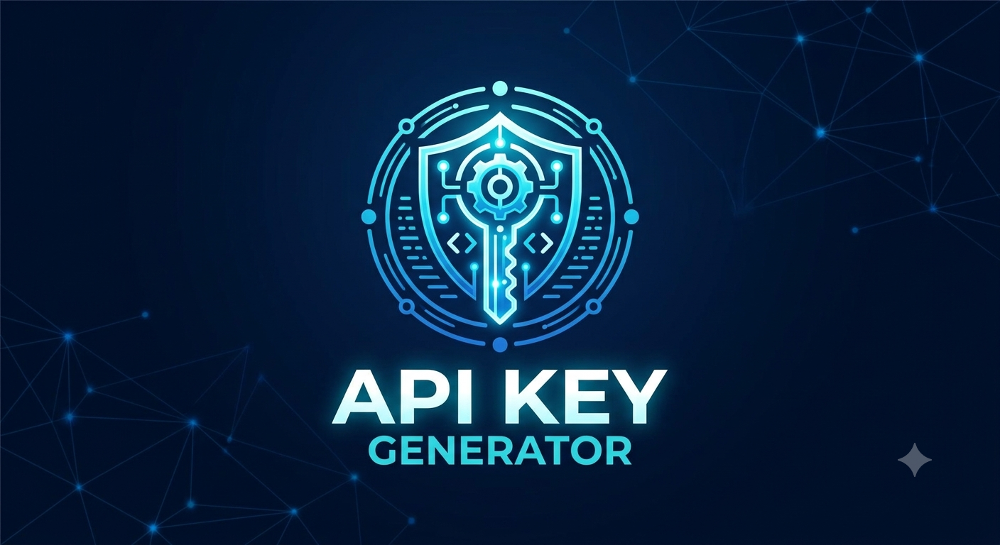

# API-KEY-GEN

  

API-KEY-GEN creates cryptographically secure, 256-bit API keys. Available in Node.js, Python, and Go, it features customizable prefixes (like 'sk_live_') and auto-generates SHA-256 hashes so you never have to store plaintext keys in your database.

## Why Use This?
Standard random number generators (like `Math.random`) are predictable and vulnerable to brute-force attacks. API-KEY-GEN uses cryptographically secure pseudorandom number generators (CSPRNG) combined with best practices for database storage.

## Features
* **256-bit Entropy:** Generates 32-byte, highly secure keys.
* **Secret-Scanning Safe:** Appends identifiable prefixes (e.g., `sk_live_`) so automated tools can flag leaked keys.
* **Dual Output:** Returns the raw key (to show your user) and a SHA-256 hash (to safely store in your DB).

## 🛠️ Architecture, Core Components & Profile Badges

These badges represent the extensive community, metadata, and architectural documentation present in your root directory.

<!-- Based on package.json, LICENSE, CODE_OF_CONDUCT.md, CONTRIBUTING.md, CONTRIBUTORS.md, CHANGELOG.md, CITATION.cff, CODEOWNERS, SECURITY.md, SECURITY.txt, and docs/ARCHITECTURE.md -->

---

## 📦 Core Programming Languages

These reflect the exact runtimes and languages implemented in your multi-language project.

<!-- Based on go/, node/, python/, .nvmrc, and .python-version -->

---

## ⚙️ Core Systems (Cryptography & Testing)

Mapped directly to the native libraries and standard testing packages utilized across all three languages.

<!-- Based on crypto/sha256, crypto/rand, hashlib, secrets, node:crypto, node:test, unittest, and testing -->

---

## 🛠️ DevOps, Infrastructure & Build Tools

This covers the exhaustive list of dotfiles, package managers, and CI/CD configurations in your root tree.

<!-- Based on .github, Dockerfile, .dockerignore, Makefile, .editorconfig, .gitattributes, .gitignore, .nvmrc, .python-version, go.mod, package.json, pyproject.toml, MANIFEST.in -->

